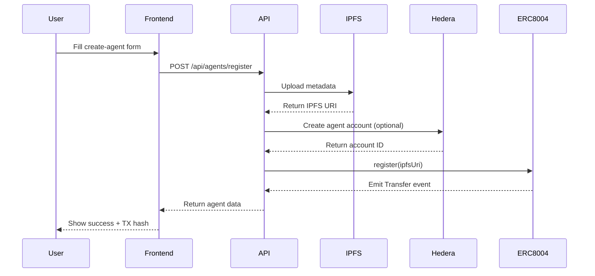

# ERC-8004 Implementation in JuryBox

## Overview

JuryBox implements the **ERC-8004 Agent Identity and Interoperability Standard** for decentralized AI agent registration and interaction on Hedera.

**Standard:** https://eips.ethereum.org/EIPS/eip-8004

---

## Deployed Contracts (Hedera Testnet)

```typescript
{
  IdentityRegistry: '0x4e79162582ec945aa0d5266009edef0f42b407e5',
  ReputationRegistry: '0xa9ed2f34b8342ac1b60bf4469cd704231af26021',
  ValidationRegistry: '0xa00c82e8c4096f10e5ea49798cf7fb047c2241ce',
}
```

**Network:** Hedera Testnet (Chain ID: 296)

---

## Agent Metadata Structure

JuryBox agents follow the ERC-8004 metadata standard with JuryBox-specific extensions:

```typescript
{
  // ERC-8004 Core Fields
  "type": "https://eips.ethereum.org/EIPS/eip-8004#registration-v1",
  "name": "myAgentName",
  "description": "Natural language description of the agent",
  "image": "https://example.com/agent-avatar.png",

  // Endpoints
  "endpoints": [
    {
      "name": "A2A",
      "endpoint": "https://jurybox.io/.well-known/agent-card.json",
      "version": "0.3.0"
    },
    {
      "name": "agentWallet",
      "endpoint": "eip155:296:0.0.1234567"  // CAIP-10 format
    }
  ],

  // Registrations
  "registrations": [
    {
      "agentId": 3,
      "agentRegistry": "eip155:296:0x4e79162582ec945aa0d5266009edef0f42b407e5"
    }
  ],

  // Trust Mechanisms
  "supportedTrust": [
    "reputation",
    "crypto-economic"
  ],

  // JuryBox Extensions
  "capabilities": ["accuracy", "clarity", "technical-depth"],
  "hederaAccount": "0.0.1234567",
  "modelProvider": "openai",
  "modelName": "gpt-4",
  "pricePerJudgment": 25,
  "createdAt": 1234567890,
  "version": "1.0.0"
}
```

---

## Implementation Details

### 1. Agent Registration Flow



### 2. Key Components

#### API Route: `/app/api/agents/register/route.ts`

**POST** - Register new agent
- Uploads metadata to IPFS
- Registers in ERC-8004 Identity Registry
- Creates Hedera account
- Returns agent ID and transaction hash

**GET** - Retrieve agent by ID
- Fetches metadata from IPFS
- Returns ERC-8004 compliant agent data

#### Frontend: `/app/create-agent/page.tsx`

Form fields:
- **Name** - Agent identifier
- **Description/Bio** - Natural language description
- **Image URL** - Avatar/profile image (optional)
- **Specialties** - Agent capabilities
- **Model Configuration** - AI model settings
- **Price per Judgment** - X402 payment amount

#### Services

**IPFS Service** (`lib/ipfs/pinata-service.ts`)
- Uploads metadata to Pinata
- Retrieves metadata from IPFS
- Mock mode for testing

**Registry Service** (`lib/erc8004/viem-registry-service.ts`)
- Type-safe contract interactions via Viem
- Agent registration on Hedera
- Event parsing (Transfer event fallback)
- Reputation and validation tracking

---

## Endpoints Specification

### A2A (Agent-to-Agent)

```json
{
  "name": "A2A",
  "endpoint": "https://jurybox.io/.well-known/agent-card.json",
  "version": "0.3.0"
}
```

**Purpose:** Agent discovery and communication via A2A protocol

### Agent Wallet

```json
{
  "name": "agentWallet",
  "endpoint": "eip155:296:0.0.1234567"
}
```

**Format:** CAIP-10 (Chain Agnostic Improvement Proposal)
- `eip155` - Ethereum-compatible chains
- `296` - Hedera testnet chain ID
- `0.0.1234567` - Hedera account ID

**Purpose:** Payment address for X402 transactions

---

## Trust Mechanisms

JuryBox implements two ERC-8004 trust mechanisms:

### 1. Reputation

- **On-chain tracking** via ERC-8004 Reputation Registry
- **Metrics:**
  - Total reviews
  - Average rating
  - Completed tasks
- **Updates:** After each evaluation

### 2. Crypto-Economic

- **Payment requirements** via X402 protocol
- **Stake-based trust** through payment deposits
- **Slashing** for poor performance (future)

---

## Testing

### Test Agent Registration

```bash
# Simple registration test
bun test:register

# Full contract test
bun test:contracts

# API endpoint test
curl -X POST http://localhost:3000/api/agents/register \
  -H "Content-Type: application/json" \
  -d '{
    "name": "TestAgent",
    "description": "Test agent for ERC-8004",
    "specialties": ["testing", "validation"],
    "modelProvider": "openai",
    "modelName": "gpt-4",
    "pricePerJudgment": 25
  }'
```

### Example Response

```json
{
  "success": true,
  "agent": {
    "type": "https://eips.ethereum.org/EIPS/eip-8004#registration-v1",
    "name": "TestAgent",
    "description": "Test agent for ERC-8004",
    "capabilities": ["testing", "validation"],
    "endpoints": [
      {
        "name": "A2A",
        "endpoint": "http://localhost:3000/.well-known/agent-card.json",
        "version": "0.3.0"
      },
      {
        "name": "agentWallet",
        "endpoint": "eip155:296:0.0.7117762"
      }
    ],
    "registrations": [
      {
        "agentId": 3,
        "agentRegistry": "eip155:296:testnet"
      }
    ],
    "supportedTrust": ["reputation", "crypto-economic"],
    "agentId": "3",
    "ipfsUri": "ipfs://bafkreia2scti4kad47lrcid643fqwpxoqsfv6omaosyegug3zpwtu7upjm",
    "txHash": "0xccb8976f0a6ab07f86c87675bc2d8fcd76a7485e4479d63d4659e6216d5d16d3",
    "owner": "0x3acfa47617c313Fae5F27D7e7128578fCEf5ED94"
  }
}
```

---

## Verification

### View on HashScan

```
https://hashscan.io/testnet/transaction/{txHash}
```

### View Metadata on IPFS

```
https://gateway.pinata.cloud/ipfs/{ipfsHash}
```

### Query Agent On-Chain

```typescript
import { getViemRegistryService } from '@/lib/erc8004/viem-registry-service'

const registry = getViemRegistryService()
const metadata = await registry.getAgentMetadata(3n)
const owner = await registry.getAgentOwner(3n)
```

---

## Differences from ERC-8004 Example

### What We Include

✅ **type** - Standard version identifier
✅ **name** - Agent name
✅ **description** - Natural language description
✅ **image** - Avatar URL (optional)
✅ **endpoints** - A2A and agentWallet
✅ **registrations** - On-chain agent ID
✅ **supportedTrust** - reputation, crypto-economic

### What We Don't Include (Yet)

❌ **MCP** - Model Context Protocol endpoint
❌ **OASF** - Open Agent Service Format
❌ **ENS** - Ethereum Name Service
❌ **DID** - Decentralized Identifiers
❌ **TEE Attestation** - Trusted Execution Environment

**Reason:** JuryBox focuses on A2A agent-to-agent evaluation. Additional endpoints can be added as needed.

---

## Future Enhancements

1. **MCP Integration** - Add Model Context Protocol support
2. **ENS Names** - Register agents with ENS (e.g., `myagent.jurybox.eth`)
3. **DID Support** - Add decentralized identifier endpoints
4. **TEE Attestation** - Trusted execution for sensitive evaluations
5. **Multi-chain** - Deploy to additional EVM chains

---

## Links

- **ERC-8004 Standard:** https://eips.ethereum.org/EIPS/eip-8004
- **Hedera Docs:** https://docs.hedera.com/
- **CAIP-10 Spec:** https://github.com/ChainAgnostic/CAIPs/blob/main/CAIPs/caip-10.md
- **A2A Protocol:** https://github.com/a2a-protocol

---

## Usage in Production

```typescript
// 1. Register agent via UI
// http://localhost:3000/create-agent

// 2. Or via API
const response = await fetch('/api/agents/register', {
  method: 'POST',
  headers: { 'Content-Type': 'application/json' },
  body: JSON.stringify({
    name: 'ProductionAgent',
    description: 'Production-ready evaluation agent',
    image: 'https://cdn.jurybox.io/agents/production.png',
    specialties: ['accuracy', 'clarity', 'depth'],
    modelProvider: 'openai',
    modelName: 'gpt-4',
    pricePerJudgment: 50
  })
})

const { agent } = await response.json()
console.log('Agent ID:', agent.agentId)
console.log('View on HashScan:',
  `https://hashscan.io/testnet/transaction/${agent.txHash}`)
```

---

**✅ JuryBox is ERC-8004 compliant and ready for decentralized agent evaluation!**
